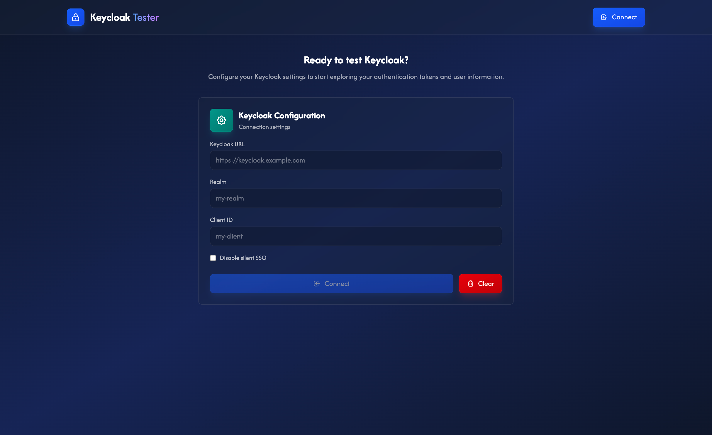
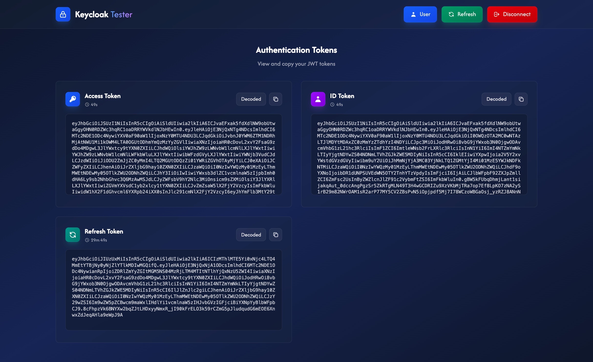
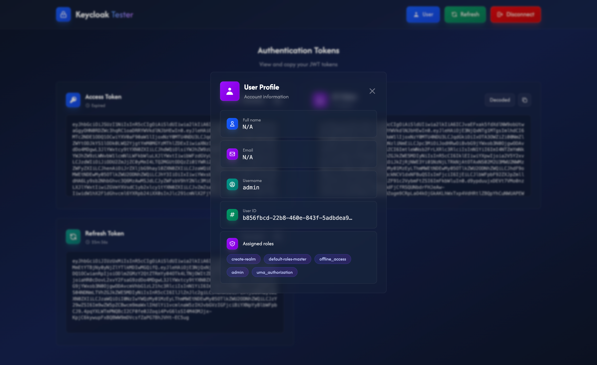

# 🔐 Keycloak Tester

A lightweight React application designed to quickly test and debug Keycloak authentication flows. This tool allows you to:

- 🔍 **Inspect JWT tokens** in real-time (Access, ID, and Refresh tokens)
- 👤 **View user information** and assigned roles
- 📋 **Copy tokens** to clipboard for API testing
- 🔄 **Test authentication flows** (login, logout, token refresh)
- ⚡ **Debug OIDC/OAuth2 issues** without backend code

Perfect for developers setting up Keycloak for the first time or testing authentication configurations.

## 📸 Screenshots

**Configuration Screen** - Fill in your Keycloak connection details



**Token Display** - View and decode all JWT tokens with live expiration timers



**User Profile** - Inspect user claims and assigned realm roles



## 🚀 Quick Start

### Prerequisites

- **Node.js 18+** - Required for React 19 and Vite 7
- **npm** or **yarn** package manager

### Installation

```bash
# Clone the repository (or download it)
git clone https://github.com/Ougobatec/Keycloak-Tester.git
cd Keycloak-Tester
```

**With npm:**

```bash
# Install dependencies
npm install

# Start the development server
npm run dev
```

**With yarn:**

```bash
# Install dependencies
yarn install

# Start the development server
yarn dev
```

The app will run on `http://localhost:3001` by default.

### Port Configuration

You can customize the port by editing the `.env` file:

```bash
PORT=3000
```

Or pass it as an environment variable:

**With npm:**

```bash
PORT=3000 npm run dev
```

**With yarn:**

```bash
PORT=3000 yarn dev
```

### Build for Production

**With npm:**

```bash
# Build for production
npm run build

# Preview the production build
npm run preview
```

**With yarn:**

```bash
# Build for production
yarn build

# Preview the production build
yarn preview
```

## 🐳 Keycloak Setup with Docker

```bash
docker run -d --name keycloak -p 127.0.0.1:8080:8080 -e KC_BOOTSTRAP_ADMIN_USERNAME=admin -e KC_BOOTSTRAP_ADMIN_PASSWORD=admin quay.io/keycloak/keycloak:latest start-dev
```

**Configure in Keycloak** (`http://localhost:8080`, login: `admin`/`admin`):

1. **Create Client**: Clients → Create → ID: `keycloak-tester`, Type: OpenID Connect
   - Standard flow: ON
   - Root URL: `http://localhost:3001`
   - Valid redirect URIs: `http://localhost:3001/*`
   - Web origins: `http://localhost:3001`

2. **Add Client Scopes**: Client scopes tab → Assign `profile`, `email`, `roles` as **default** scopes

3. **Create User**: Users → Add user → Set username, email, name → Credentials tab → Set password (Temporary: OFF)

## 📋 How to Use

### Step 1: Configure Connection

Open the app and fill in your Keycloak configuration:

| Field            | Example                 | Description                           |
| ---------------- | ----------------------- | ------------------------------------- |
| **Keycloak URL** | `http://localhost:8080` | Your Keycloak server URL              |
| **Realm**        | `master`                | The realm name in Keycloak            |
| **Client ID**    | `keycloak-tester`       | The client ID you configured          |
| **Silent SSO**   | ☑️ Disable (optional)   | Uncheck to skip iframe session checks |

The configuration is automatically saved to `localStorage` for convenience.

### Step 2: Connect & Authenticate

Click the **Connect** button. You'll be redirected to Keycloak's login page. Log in with your user credentials.

### Step 3: Explore Tokens

After successful authentication, you'll see three token cards:

- **Access Token** (blue) - Used for API authorization
- **ID Token** (purple) - Contains user identity information
- **Refresh Token** (teal) - Used to obtain new tokens without re-login

For each token you can:

- 🔄 Toggle between **Raw JWT** and **Decoded JSON**
- 📋 **Copy to clipboard** with one click
- ⏱️ View **live expiration countdown**

### Step 4: View User Profile

Click your username in the navigation bar to open the user profile modal, which displays:

- Full name, email, and username
- User ID (sub claim)
- Assigned realm roles

### Step 5: Manage Session

- **Refresh**: Click the Refresh button to manually refresh your tokens
- **Disconnect**: Log out and clear your session

## ✨ Features

- ✅ **Standard OIDC Flow** - Authorization Code Flow with PKCE support
- 🔄 **Token Refresh** - Manually refresh tokens with a single click
- 🔒 **Silent SSO** - Automatic session detection via iframe
- 📋 **One-Click Copy** - Copy tokens to clipboard for API testing
- ⏱️ **Live Expiration Timers** - Real-time countdown for token expiration
- 🔀 **Token Decoder** - Toggle between raw JWT and decoded JSON
- 💾 **Auto-Save Configuration** - Settings stored in localStorage

## 🧪 Troubleshooting

### Common Issues

**"Invalid redirect URI" Error**

- Verify that your client's **Valid redirect URIs** matches your app's port
- Example: `http://localhost:3001/*`
- Make sure the app is running on the port specified in `.env`
- Restart the app after changing the port

**"User info not showing in ID token"**

- Ensure `profile` and `email` scopes are assigned as **default** scopes (not optional)
- Go to: Clients → your client → Client scopes tab
- See `KEYCLOAK_CONFIG.md` for detailed instructions

**"CORS Error"**

- Add your app URL to **Web origins** in Keycloak client settings
- Example: `http://localhost:3001`
- In development mode, you can use `*` for testing

**"Port Already in Use"**

**With npm:**

```bash
# Use a different port temporarily
PORT=3002 npm run dev
```

**With yarn:**

```bash
# Use a different port temporarily
PORT=3002 yarn dev
```

**"Keycloak Container Not Starting"**

```bash
# Check container logs
docker logs keycloak
```

```bash
# Stop and remove container
docker stop keycloak && docker rm keycloak
```

## 📦 Tech Stack

- **React 18** - Modern UI library with hooks
- **TypeScript** - Type-safe development
- **Vite** - Lightning-fast build tool
- **Keycloak-js** - Official Keycloak JavaScript adapter
- **Tailwind CSS** - Utility-first styling

## 📄 License

MIT License - Free to use for personal and commercial projects
